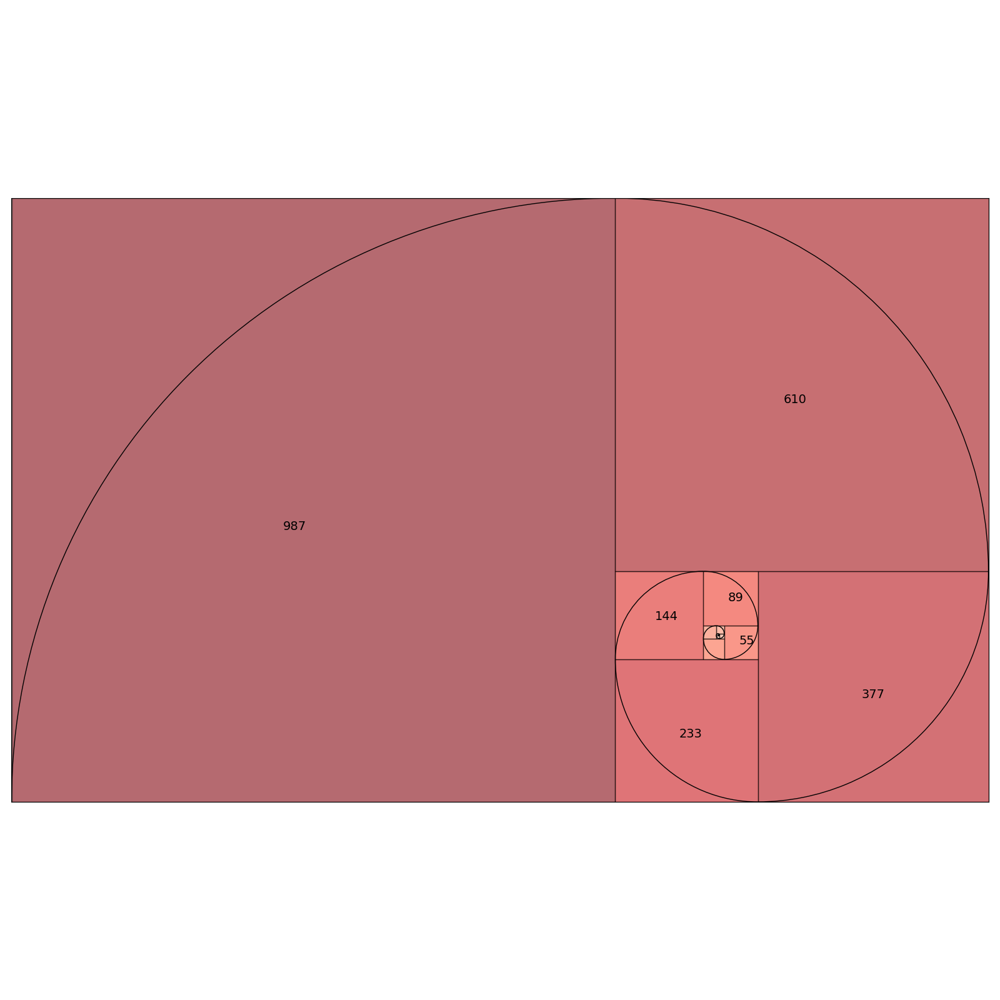

# fibonacci_spiral

Python script to generate a Fibonacci spiral plot, using matplotlib

https://en.wikipedia.org/wiki/Fibonacci_number


```
usage: python fibonacci_spiral.py [-h] -n NUMBER_OF_SQUARES [-o OUTPUT] [--no-label]
                           [--no-arc] [-c CMAP]

Creates a plot for a fibonacci spiral

optional arguments:
  -h, --help            show this help message and exit
  -n NUMBER_OF_SQUARES, --number_of_squares NUMBER_OF_SQUARES
                        number of squares in spiral
  -o OUTPUT, --output OUTPUT
                        Plot file name
  --no-label            Remove label showing side lenght at the center of each
                        square
  --no-arc              Remove arc of fibonacci spiral
  -c CMAP, --cmap CMAP  Colormap applied to fibonacci squares
```

Example plot:


