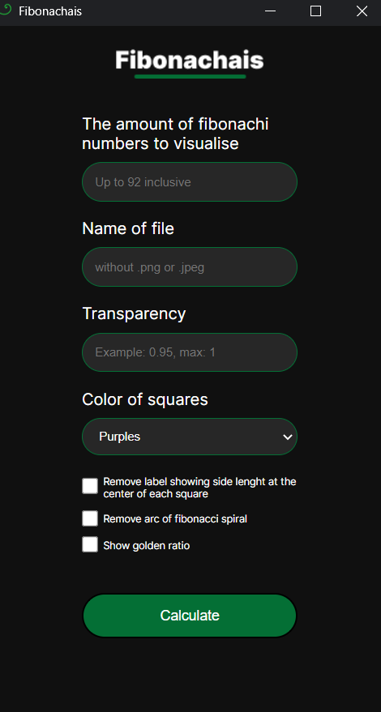

# fibonacci_spiral

Python script to generate a Fibonacci spiral plot, using matplotlib

https://en.wikipedia.org/wiki/Fibonacci_number

## Installation

Build the project using poetry  ```poetry install```


## Usage:

```poetry run python fibonacci_spiral.py ```

This file will open ui interface. Just put your data and the file will open. You can type data as many times as you want.

Screenshot:



Example plot:


Gif that use images from this program:


